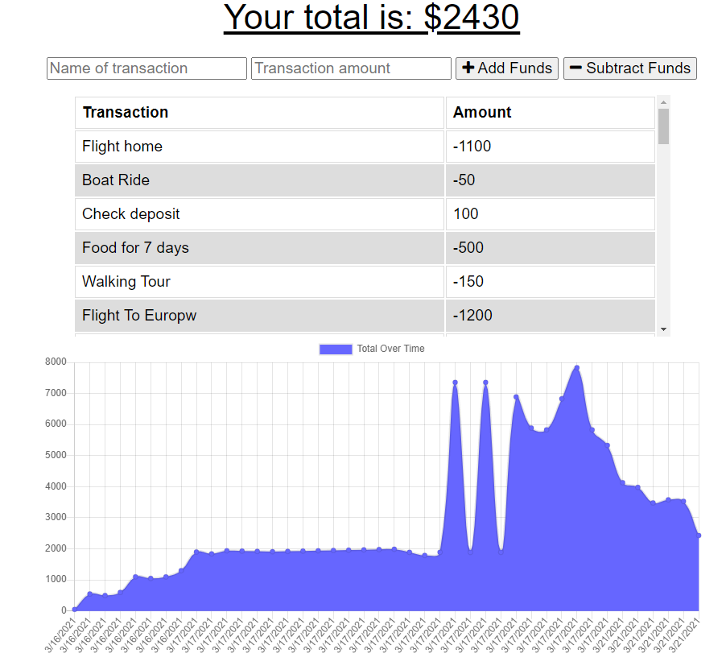

# Budget Tracker

### Description
_____________________________
This application is a great way to track your expenses on the go, even when your connection is not ideal!  If you lose connectivity, this app will log your expense changes and upload them when your connection is restored.

### Table of Contents
_____________________________
* [Installation](#installation)
* [Usage](#usage)
* [Questions](#questions)

### Installation
_____________________________
*Steps required to install and run this program:*

There are no special installation instructions, simply click on the link below.

Click on the [link](https://warm-badlands-82966.herokuapp.com/)!

### Usage
_____________________________
*Instructions and example for use:*

Enter the name of the transaction you would like to track, enter the amount and whether this transaction is adding or subtracting funds.

This is an example of what your transaction history can look like:

### Questions
_____________________________

  Please click on the link provided to access the author's [Github](http://github.com/RaeStichter).
  